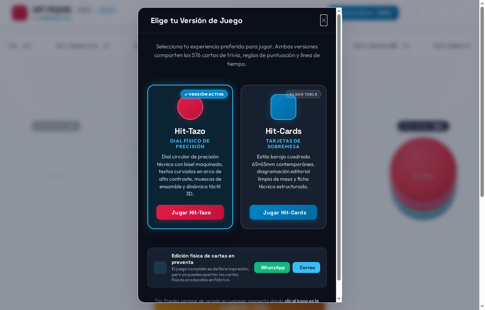
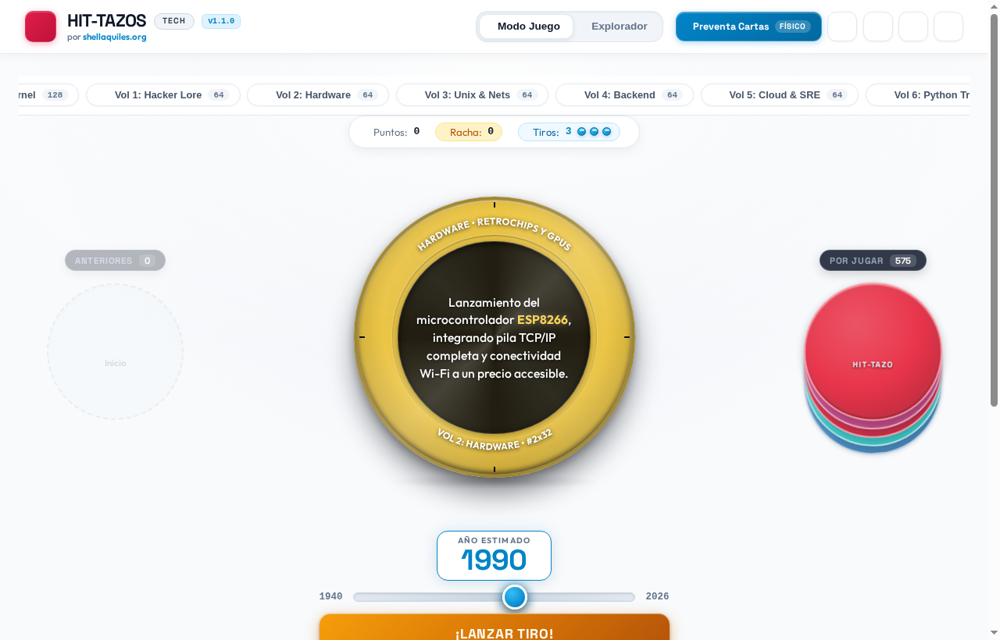
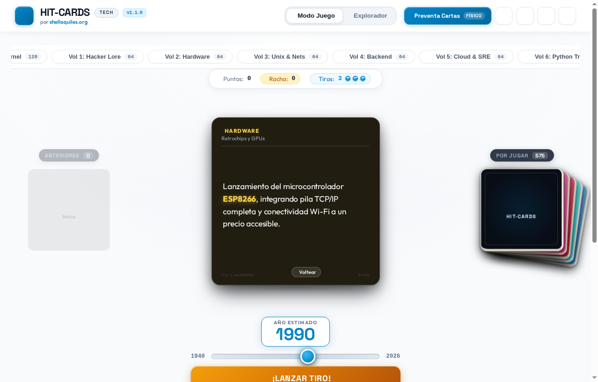
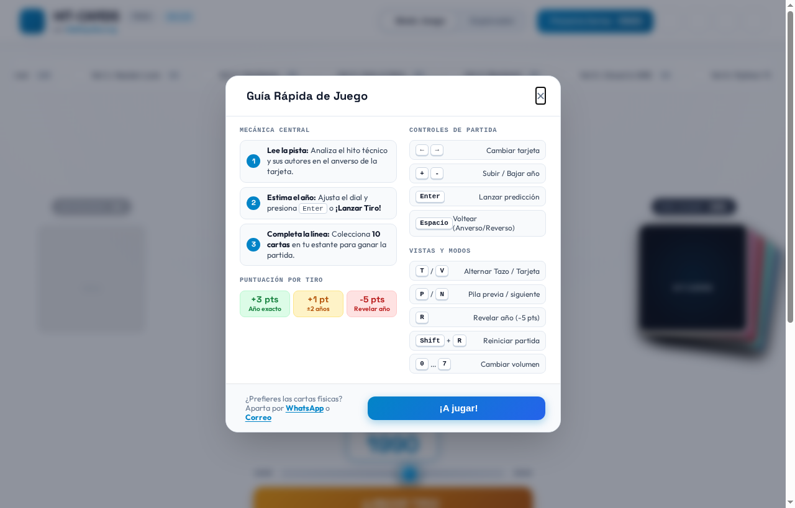

# Hit-Tazos Tech 🕹️💻

[](./CHANGELOG.md)
[](./LICENSE)
[](https://www.python.org/)
[](https://nodejs.org/)

Juego de trivia y orden cronológico sobre historia de la computación, software libre, sistemas, IA, silicio y el ecosistema Python. 

Funciona como aplicación web interactiva en el navegador y como juego de cartas físico de 576 tarjetas coleccionables.

---

## 🎮 Jugar en línea

Pruébalo directo en el navegador sin instalar nada:

👉 **[shellaquiles.github.io/hit-tazos-tech](https://shellaquiles.github.io/hit-tazos-tech/)**

La versión web incluye:
* Selector de formato: **Tazo circular 3D** o **Carta cuadrada** ($65 \times 65\text{ mm}$).
* Partida interactiva con dial de años, pistas por proximidad (frío/tibio/caliente) y sonido retro vía Web Audio API.
* Catálogo completo con buscador en tiempo real y vista en abanico.

---

## 📸 Capturas de Pantalla (Preview)

| Selector de Experiencia | Modo Hit-Tazo (Dial 3D) |
| :---: | :---: |
| [](./docs/screenshots/01-selector-version.png) | [](./docs/screenshots/02-gameplay-hit-tazo.png) |
| *Modal inicial de bienvenida y formato* | *Dial táctil retro con muescas CNC y estante* |

| Modo Hit-Cards (65×65 mm) | Guía Rápida y Atajos |
| :---: | :---: |
| [](./docs/screenshots/03-gameplay-hit-cards.png) | [](./docs/screenshots/04-guia-rapida-juego.png) |
| *Tarjeta de sobremesa contemporánea* | *Pistas anti-spoiler y atajos de teclado* |

---

## 🕹️ Cómo se juega

### En la web (Modo Arcade)
* **Objetivo:** Acertar el año de 10 tarjetas para armar tu línea de tiempo.
* **Mecánica:** Lees el hito y su autor (el año viene oculto). Mueves el dial temporal con el ratón o con las teclas `+` / `-` y disparas con `Enter`.
* **Intentos y pistas:** Tienes 3 tiros por tarjeta. Si fallas, el juego te indica la dirección (`↑ Más reciente` / `↓ Más antiguo`) y qué tan cerca estás (caliente $\le 5$ años, tibio $\le 15$, frío $> 15$).
* **Puntos:** 
  * Año exacto: +3 pts.
  * Margen de $\pm 2$ años: +1 pto.
  * Revelar el año cuesta 5 puntos acumulados.

### En mesa (Juego de cartas)
* **Objetivo:** Ser el primero en armar una línea de tiempo con 10 cartas ordenadas de más antigua a más reciente.
* **Preparación:** Cada jugador recibe 1 carta inicial boca arriba (año visible) y 3 fichas de apuesta.
* **Turno:**
  1. El jugador de la izquierda toma una carta del mazo y lee solo el hito del frente (sin ver el año ni el creador).
  2. El jugador en turno decide en qué posición de su línea temporal la coloca (antes, después o entre dos cartas que ya tenga).
  3. Los rivales pueden apostar una ficha a otra posición si creen que está equivocado.
  4. Se voltea la carta: quien tenga la posición correcta se la queda.

---

## 🖨️ Impresión y cartas físicas

El juego es libre bajo licencia MIT y puedes descargar los archivos listos para imprimir en casa o imprenta (*Print & Play*). 

Las cartas están diseñadas en formato cuadrado de **$65 \times 65\text{ mm}$** con esquinas redondeadas ($r=3\text{ mm}$), pensadas para imprimirse en cartulina de **$350\text{ g}$** con barniz mate anti-reflejante.

### Archivos PDF oficiales para imprenta (Print & Play)
Los PDFs vectoriales oficiales con marcas de corte, sangrado de +3 mm y reversos espejados están disponibles para descarga directa en la [**Última Release Oficial (v1.0.0)**](https://github.com/shellaquiles/hit-tazos-tech/releases/latest):

* 📦 **[Descarga de los 8 Volúmenes en PDF (Tamaño Carta)](https://github.com/shellaquiles/hit-tazos-tech/releases/latest)**: 6 cartas por pliego (65×65 mm c/u), optimizados para impresión dúplex.
* 📐 Formatos profesionales multi-pliego disponibles para compilación local:
  - **Carta (8.5 × 11 pulg):** Rejilla $2 \times 3$ (6 cartas/pliego, 192 páginas dúplex).

### Adquirir las cartas en preventa
Si prefieres tener el juego físico ya impreso y en caja rígida:
* 💬 **WhatsApp:** [+52 55 4272 2156](https://wa.me/525542722156?text=Hola%20shellaquiles.org%2C%20me%20interesa%20apartar%20la%20edici%C3%B3n%20f%C3%ADsica%20de%20Hit-Cards%20Tech%20en%20preventa)
* ✉️ **Correo:** [preventa@shellaquiles.org](mailto:preventa@shellaquiles.org?subject=Preventa%20Hit-Cards%20Tech%20-%20Edici%C3%B3n%20F%C3%ADsica&body=Hola%20equipo%20de%20shellaquiles.org%2C%0A%0AMe%20gustar%C3%ADa%20solicitar%20informaci%C3%B3n%20para%20apartar%20las%20cartas%20f%C3%ADsicas%20en%20preventa.%0A%0ASaludos.)
* 🌐 **Sitio oficial:** [shellaquiles.org](https://shellaquiles.org)

---

## 📑 Contenido del mazo (576 cartas en 8 volúmenes)

El mazo se divide en 8 volúmenes canónicos con taxonomía cerrada:

| Vol | Slug Oficial | Cartas | Rango Hex | Archivo PDF Oficial | Temas principales |
| :---: | :--- | :---: | :---: | :--- | :--- |
| **0** | `kernel-foundations` | 128 | `0x00–0x7F` | [`hit-tazos-tech-vol0-kernel-foundations.pdf`](https://github.com/shellaquiles/hit-tazos-tech/releases/latest/download/hit-tazos-tech-vol0-kernel-foundations.pdf) | Von Neumann, lógica booleana, teoría de la información, Linux, C y papers de IA. |
| **1** | `cypherpunks-hacker-lore` | 64 | `0x00–0x3F` | [`hit-tazos-tech-vol1-cypherpunks-hacker-lore.pdf`](https://github.com/shellaquiles/hit-tazos-tech/releases/latest/download/hit-tazos-tech-vol1-cypherpunks-hacker-lore.pdf) | Criptografía asimétrica, manifiestos, FOSS, P2P, malware y cultura hacker. |
| **2** | `embedded-silicon-hardware` | 64 | `0x00–0x3F` | [`hit-tazos-tech-vol2-embedded-silicon-hardware.pdf`](https://github.com/shellaquiles/hit-tazos-tech/releases/latest/download/hit-tazos-tech-vol2-embedded-silicon-hardware.pdf) | Microprocesadores clásicos, microcontroladores, arquitecturas CISC/RISC y silicio. |
| **3** | `unix-sysadmin-networks` | 64 | `0x00–0x3F` | [`hit-tazos-tech-vol3-unix-sysadmin-networks.pdf`](https://github.com/shellaquiles/hit-tazos-tech/releases/latest/download/hit-tazos-tech-vol3-unix-sysadmin-networks.pdf) | Filosofía Unix, TCP/IP, DNS, protocolos RFC de red y administración de servidores. |
| **4** | `backend-distributed-systems` | 64 | `0x00–0x3F` | [`hit-tazos-tech-vol4-backend-distributed-systems.pdf`](https://github.com/shellaquiles/hit-tazos-tech/releases/latest/download/hit-tazos-tech-vol4-backend-distributed-systems.pdf) | Bases de datos, colas de mensajes, concurrencia y patrones de backend distribuido. |
| **5** | `cloud-containers-sre` | 64 | `0x00–0x3F` | [`hit-tazos-tech-vol5-cloud-containers-sre.pdf`](https://github.com/shellaquiles/hit-tazos-tech/releases/latest/download/hit-tazos-tech-vol5-cloud-containers-sre.pdf) | Contenedores (Docker, k8s), IaC, nubes públicas y prácticas de observabilidad SRE. |
| **6** | `python-track` | 64 | `0x00–0x3F` | [`hit-tazos-tech-vol6-python-track.pdf`](https://github.com/shellaquiles/hit-tazos-tech/releases/latest/download/hit-tazos-tech-vol6-python-track.pdf) | PEPs históricos, runtimes, GIL, stack científico y evolución del lenguaje Python. |
| **7** | `scifi-pop-culture-cinema` | 64 | `0x00–0x3F` | [`hit-tazos-tech-vol7-scifi-pop-culture-cinema.pdf`](https://github.com/shellaquiles/hit-tazos-tech/releases/latest/download/hit-tazos-tech-vol7-scifi-pop-culture-cinema.pdf) | Cine hacker, ciencia ficción dura, literatura especulativa y cultura pop tech. |

---

## ⌨️ Controles y Atajos de Teclado

| Atajo | Acción en la Aplicación Web |
| :---: | :--- |
| <kbd>+</kbd> / <kbd>-</kbd> o <kbd>↑</kbd> / <kbd>↓</kbd> | Ajustar el año del tiro en el dial interactivo. |
| <kbd>Enter</kbd> | Disparar tiro o confirmar intento. |
| <kbd>Espacio</kbd> | Voltear la tarjeta activa (anverso $\leftrightarrow$ reverso). |
| <kbd>P</kbd> / <kbd>N</kbd> | Navegar a la tarjeta Previa (<kbd>P</kbd>) o Siguiente (<kbd>N</kbd>) en las pilas. |
| <kbd>V</kbd> | Abrir el modal de selección de formato (Hit-Tazo 3D vs. Hit-Cards). |
| <kbd>T</kbd> | Alternar directamente entre formato Tazo y formato Tarjeta. |
| <kbd>?</kbd> / <kbd>H</kbd> | Abrir la Guía Rápida de Juego (#help-dialog). |
| <kbd>Shift</kbd> + <kbd>R</kbd> | Reiniciar partida completa (restablece puntos, racha y estante con confirmación). |

---

## 🏛️ Arquitectura del Motor Web (Zero-Bundler ES Modules)

El código fuente del frontend reside bajo una arquitectura modular limpia en `web/core/` sin requerir herramientas de empaquetado (Zero-Bundler):

* **`web/core/constants.js`:** Constantes canónicas inmutables (reglas, paletas HSL, límites cronológicos y almacenamiento).
* **`web/core/rules.js`:** Funciones puras de puntuación (+3 exacto, +1 cercano), cálculo de pistas cualitativas y ordenamiento del estante.
* **`web/core/storage.js`:** Adaptador de persistencia asíncrona dual (IndexedDB con fallback a `localStorage`).
* **`web/core/state.js`:** Máquina de estado reactiva `GameState` con patrón Observer (Pub/Sub) desacoplado del DOM.
* **`web/core/audio.js`:** Motor de efectos sonoros retro sintetizados con control de volumen y mute.
* **`web/core/tazo-renderer.js`:** Renderizado 3D de disco retro con bisel CNC, notches y radio seguro $r=112$.
* **`web/core/cards-renderer.js`:** Renderizado de tarjetas de colección cuadradas de $65 \times 65\text{ mm}$.
* **`web/app.js`:** Coordinador reactivo `HitTazosApp` enlazando eventos, gestos táctiles y teclado.

---

## 💻 Desarrollo local y pruebas

### Levantar el juego localmente
Funciona con Vanilla JS, CSS y HTML5 estándar:

```bash
# Con Node.js:
npm run serve

# O directo con Python:
python3 -m http.server 3333
```

### Pruebas y compilación
```bash
# Ejecutar suite de pruebas (24 tests unitarios, paridad de versión y auditoría en 4 niveles):
npm test

# Compilar mazo maestro y actualizar manifest tras editar tarjetas:
npm run build

# Generar capturas de pantalla de alta fidelidad (solo al final del desarrollo antes de liberar a producción):
npm run screenshots

# Generar pliegos de imprenta (Formato Carta):
npm run print:carta
```

Para especificaciones avanzadas de datos, Data Contract y reglas editoriales en 4 niveles, consulta [**`AGENTS.md`**](./AGENTS.md).

---

## 📄 Licencia

Código y datos bajo licencia MIT de **shellaquiles.org**.

* 📜 [Licencia MIT](./LICENSE)
* 📋 [Changelog](./CHANGELOG.md)
* 🤝 [Guía de Contribución](./CONTRIBUTING.md)
* 🛡️ [Seguridad](./SECURITY.md)
* 📜 [Código de Conducta](./CODE_OF_CONDUCT.md)
